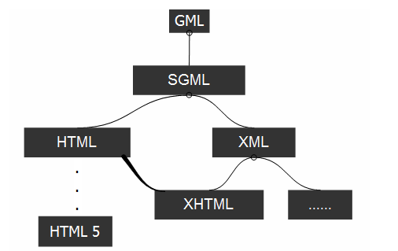

XML 基础知识
===

是什么
---
* **扩展性标识语言**:`Extensible Markup Language`文件后缀为 .xml;
* **传输和存储数据**;
* **纯文本**:有能力处理纯文本的软件都可以处理XML

作用
---

不同应用，不同平台间的共享和通信。
1. **数据分离**:
	- 数据能够独立存储在单独的XML文件中，（通过JavaScript，读取外部XML文件，更新数据内容）;
1. **简化数据共享**:
	- 可作为一种简单的数据库，存储和检索数据（`以纯文本格式进行存储`);
1. **简化数据传输**:
	- 以文本格式存储（在**变更浏览器**或**升级系统**时，更容易兼容，**数据不易丢失**）
	- 在充当通用数据时才有价值
	* eg.AJAX中传输数据即为XML格式

语法规则
---

XML DOM 是用于获取、更改、添加或删除 XML 元素的标准。
```
<?xml version="1.0" encoding="UTF-8"?>
<?xml-stylesheet type="text/xsl" href="../xslt/index.xsl"?>
<catalog>
<!-- 标签自定义 -->
  <cd>
    <title>Empire Burlesque</title>
		<message>if salary &lt; 1000 then</message>
		<!-- 实体引用 -->
    <artist>Bob Dylan</artist>
    <country>USA</country>
    <company>Columbia</company>
    <price>10.90</price>
    <year>1985</year>
  </cd>
	<note date="08/08/2008">
	<!-- 属性 必加引号-->
		<div>
			<p>
			this is a paragraph!
			<!-- 必须正确的嵌套 -->
			</p>
		</div>
		<to>George</to>
		<from>John</from>
	</note>
	<f:table xmlns:f="http://www.w3school.com.cn/furniture">
   	<f:name>African Coffee Table</f:name>
	 		<!-- 命名空间 ：为table标签添加了一个带有家具信息的前缀f:-->
	   <f:width>80</f:width>
	   <f:length>120</f:length>
	 </f:table>
.
.
.
</catalog>
```
* **声明节点**：放在XML的第一行
* **文档节点**：整个文档
* **元素节点**：每个XML标签
	* 从（且包括）开始标签直到（且包括）结束标签的部分
* **属性节点**:属性
* **文本节点**：
	- 元素或属性中的文本内容
* **注释节点**：注释
* **处理指令**:用<’?和?>定界符包起来
	- eg:XML声明/对应用程序特定的数据编码
* **文档片段**：
	- 充当临时的容器，可避免多次直接向DOM添加元素时，浏览器多次渲染
* **实体/实体引用**:
	- 引用特殊字符：`&lt;` >,`&gt;`< ,`&amp`&,`apos`'',`quot`“”
* **CDATA**（character data-字符数据）
	* 特殊节点，包含不应被解析器分析的信息
	* eg：CDATA <![CDATA[文本内容]]>
* **语法规则**
	* 可自定义标签/文档结构
	* 必有根元素
	* 必有关闭标签
	* 大小写敏感
	* 正确的嵌套
	* 属性必加引号
	* 实体引用
	* 注释
	* 命名空间
		1.__命名冲突__：两个不同的文档使用相同的元素名时，会发生冲突
		2.__使用前缀避免冲突__: eg:(<table> 元素中<h:table><f:table>)
		3.__使用命名空间__: xmlns:namespace-prefix="namespaceURL"
		4.**默认的命名空间**：xmlns="namespaceURL"


标记语言的演化
---



1.  SGML(Standard Generalized Markup Language)标准通用标记语言
2.  **XML，HTML同基于SGML**:
	- HTML是SGML的一个应用，用来显示数据(给人看)
	* XML是SGML的一个子集，用来存储和传输数据（给计算机看），为了简化SGML
	* HTML标签是预定义的,XML标签是自定义的
3. **XHTML是基于XML格式编写的HTML**
	- 是HTML向XML过渡的一种语言，用来规范HTML的格式
	- 容错机制瘫痪
4. **HTML5不基于SGML**
	- 是HTML的第五代版本，使得HTML更富应用化
	- 相比XHTML新增了一些特性，又有所保留
		- 制定相应的容错体系
		- 严格模式（不太理想的XHTML）和宽松模式
